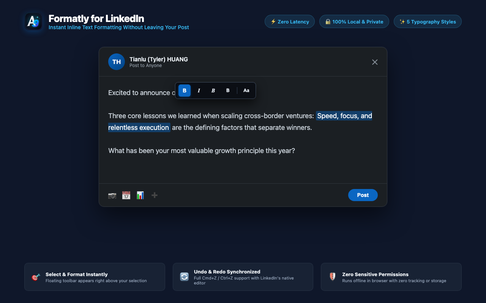

# Formatly for LinkedIn: Bold, Italic & Font Styles

<p align="center">
  
</p>

<p align="center">
  <strong>An inline formatting toolbar for LinkedIn creators, founders, and professionals.</strong>
</p>

<p align="center">
  <a href="LICENSE"></a>
  
  
  
  
</p>

---

## Overview

Formatly for LinkedIn is a lightweight browser extension that provides inline text styling directly within LinkedIn's web interface. It removes the need to switch tabs to external font generator tools when writing posts, comments, or articles.

Selecting text inside LinkedIn's composer brings up a focused formatting toolbar immediately above the cursor, allowing immediate conversion to bold, italic, bold-italic, and sans-serif bold Unicode styles, with one-click restoration to plain text.

<p align="center">
  
</p>

---

## Features

- **Instant Floating Toolbar**: Positioned directly over selected text within editable post composers, comments, and articles.
- **Five Core Styles**:
  - Serif Bold: `𝐇𝐞𝐥𝐥𝐨 𝐋𝐢𝐧𝐤𝐞𝐝𝐈𝐧`
  - Serif Italic: `𝐻𝑒𝑙𝑙𝑜 𝐿𝑖𝑛𝑘𝑒𝑑𝐼𝑛`
  - Bold Italic: `𝑯𝒆𝒍𝒍𝒐 𝑳𝒊𝒏𝒌𝒆𝒅𝑰𝒏`
  - Sans-Serif Bold: `𝗛𝗲𝗹𝗹𝗼 𝗟𝗶𝗻𝗸𝗲𝗱𝗜𝗻`
  - Plain Revert (`Aa`): Converts stylized Unicode back to standard ASCII text.
- **Universal Cross-Platform Rendering**: Based on international Unicode mathematical alphanumeric symbols. Styled text renders consistently across iOS, Android, web browsers, and email previews without requiring extensions for readers.
- **Editor Synchronization**: Dispatches native input events through `document.execCommand('insertText')` to keep LinkedIn's internal Quill editor model in sync, preserving the active Post button state and native undo/redo history (`Cmd+Z` / `Ctrl+Z`).
- **Zero Sensitive Permissions**: Runs fully local and offline. Declares no storage permissions, no background service worker, and transmits no telemetry or user data.
- **Strict Site Isolation**: Limited exclusively to `*.linkedin.com`. The extension does not inject or observe activity on any other domain.
- **Lightweight Architecture (~35KB)**: Implemented in clean Vanilla ES6+ without React, bundlers, or third-party runtime dependencies.

<p align="center">
  
</p>

---

## Installation

### Store Releases
- **Chrome Web Store**: Pending publication review
- **Microsoft Edge Add-ons**: Pending publication review

### Manual Installation (Developer Mode)

1. Clone or download the repository:
   ```bash
   git clone https://github.com/xemee82/formatly-for-linkedin.git
   ```
2. Open extension settings in your browser:
   - Google Chrome: `chrome://extensions`
   - Microsoft Edge: `edge://extensions`
3. Enable **Developer mode**.
4. Click **Load unpacked** and select the repository root folder.
5. Navigate to [LinkedIn](https://www.linkedin.com/feed/), create a post, and highlight any text to begin formatting.

---

## Usage

1. Open LinkedIn and begin a new post, comment, or article.
2. Select the words or phrases you wish to emphasize.
3. The formatting toolbar appears above the selection.
4. Click `B`, `I`, `B`, or `𝗕` to apply the desired style.
5. Highlight styled text and click `Aa` to revert, or press `Cmd+Z` / `Ctrl+Z` to undo.

---

## Engineering Highlights

Modern Web applications employ strict runtime defenses, including Web Components, Shadow DOM encapsulation, and Content Security Policies. Formatly addresses these design challenges:

1. **Trusted Types CSP Compliance**: LinkedIn enforces Trusted Types policies that disallow direct `innerHTML` assignments. Formatly constructs and mounts all DOM nodes using programmatic DOM APIs (`document.createElement`), preventing CSP violations.
2. **Shadow DOM Selection Penetration**: Modern LinkedIn post editors reside inside open shadow roots under `#interop-outlet`. Standard `window.getSelection()` returns retargeted coordinates with zero-width boundaries. Formatly traverses active shadow hierarchies (`activeElement.shadowRoot.getSelection()`) to compute true bounding rectangles.
3. **Quill.js Model Alignment**: Direct DOM node replacements fail to update Quill's internal Delta store, which can disable submit actions. Formatly uses native input commands that propagate naturally through the editor's event pipeline.

---

## Open Source Heritage

This project acknowledges the exploratory work of [viclafouch/beautify-post](https://github.com/viclafouch/beautify-post) (MIT License, by Victor de la Fouchardiere). 

Formatly represents a complete re-implementation tailored to contemporary LinkedIn infrastructure:
- Replaced the React 18 / Emotion / Webpack stack with dependency-free Vanilla ES6+, reducing package size by 95%.
- Implemented Shadow DOM traversal to accommodate `#interop-outlet` encapsulation.
- Structured all UI construction around native DOM nodes to maintain full Trusted Types compliance.
- Added bidirectional Unicode mapping, comment-field coverage, and sans-serif bold styling.

Detailed architecture comparisons are documented in [HANDOVER.md](file:///Users/tylerh/Documents/Antigravity/linkedin-text-formatter/HANDOVER.md).

---

## Trademark Disclaimer

Formatly for LinkedIn is an independent open-source project and is not affiliated with, sponsored by, or endorsed by LinkedIn Corporation. "LinkedIn" is a registered trademark of LinkedIn Corporation.

---

## About the Author

- **Origin**: Singapore
- **Author**: Tianlu (Tyler) HUANG ([LinkedIn Profile](https://www.linkedin.com/in/tylerhuangsg/))
- **Affiliation**: Co-founder & COO, Transfong | Cross-Border Tech Ventures
- **Scope**: Focused on minimalist, non-invasive productivity tools for cross-border founders, operators, and writers.

---

## 简体中文概览 (Summary in Chinese)

**Formatly for LinkedIn** 是一款面向专业创作者与商务人士的轻量级领英排版扩展（Manifest V3）。

### 核心特性
1. **即划即弹**：在 LinkedIn 发帖框、评论区或文章编辑器中划选文字，浮动工具栏自动定位至选区上方。
2. **五款常用样式**：提供衬线粗体、衬线斜体、粗斜体、无衬线粗体，以及 `Aa` 一键还原纯文本。
3. **严格域名隔离**：仅在 `*.linkedin.com` 作用域内运行，绝不注入或监听其他任何网站，安装时无宽泛权限告警。
4. **全端原生呈现**：基于国际 Unicode 数学字母编码，排版在移动端（iOS / Android）、网页端及邮件摘要中均可直接显示，阅读者无需安装插件。
5. **底层编辑器同步**：使用原生输入指令保持与 Quill 编辑器内部状态同步，完整保留 `Cmd+Z` / `Ctrl+Z` 撤销重做历史。
6. **零敏感权限与离线运算**：不申请存储与网络权限，不收集任何用户输入与浏览数据，全流程本地即时处理。
7. **宽松开源协议**：采用 MIT 许可证开放源码。

---

## License

This project is licensed under the [MIT License](LICENSE).  
Copyright (c) 2026 Tianlu (Tyler) HUANG.
