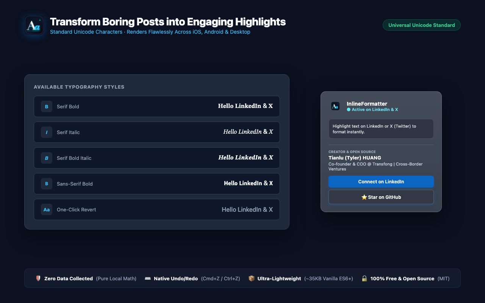

# Formatly for LinkedIn: Bold, Italic & Font Styles

<p align="center">
  
</p>

<p align="center">
  <strong>The sleek, instant, zero-permission inline formatting toolbar for LinkedIn creators, founders, and professionals.</strong>
</p>

<p align="center">
  <a href="LICENSE"></a>
  
  
  
  
</p>

---

## 🌟 Overview

**Formatly for LinkedIn** is a lightweight, lightning-fast browser extension built for modern professionals. It eliminates the friction of switching browser tabs to copy-paste formatted text from external generator websites like YayText.

Whenever you select text inside LinkedIn's post composer, comment field, or article editor, a polished floating toolbar appears right above your selection. With a single click, convert plain text into bold, italic, bold-italic, or sans-serif bold typography—or revert back to plain text anytime.

<p align="center">
  
</p>

---

## ✨ Key Features

- 🎯 **Instant Floating Toolbar**: Appears dynamically above your highlighted text with zero delay.
- 🔤 **5 Essential Typography Styles**:
  - **B (Serif Bold)**: `𝐇𝐞𝐥𝐥𝐨 𝐋𝐢𝐧𝐤𝐞𝐝𝐈𝐧`
  - **I (Serif Italic)**: `𝐻𝑒𝑙𝑙𝑜 𝐿𝑖𝑛𝑘𝑒𝑑𝐼𝑛`
  - **B (Bold Italic)**: `𝑯𝒆𝒍𝒍𝒐 𝑳𝒊𝒏𝒌𝒆𝒅𝑰𝒏`
  - **𝗕 (Sans-Serif Bold)**: `𝗛𝗲𝗹𝗹𝗼 𝗟𝗶𝗻𝗸𝒆𝗱𝗜𝗻`
  - **Aa (One-Click Revert)**: Restores any formatted Unicode back to clean plain text.
- 🌐 **Universal Cross-Platform Rendering**: Formatted with standard mathematical Unicode characters. Renders natively on iOS, Android, desktop browsers, and email notifications without readers needing any plugin.
- 🔄 **Native Undo/Redo Synchronized**: Fully integrated with LinkedIn's internal Quill.js editor via native input transactions. Press `Cmd+Z` / `Ctrl+Z` to undo seamlessly.
- 🛡️ **Zero Sensitive Permissions**: Runs 100% locally and offline. Requires NO external host permissions, NO storage permissions, and collects NO telemetry or personal data.
- ⚡ **Ultra Lightweight (~35KB)**: Built with pure Vanilla ES6+ without React, Webpack, or external dependencies.

<p align="center">
  
</p>

---

## 🚀 Quick Installation

### Option A: Install from Store (Recommended)
- **Chrome Web Store**: *Pending review submission*
- **Microsoft Edge Add-ons**: *Pending review submission*

### Option B: Load Unpacked in Developer Mode

1. **Clone or Download** this repository:
   ```bash
   git clone https://github.com/xemee82/formatly-for-linkedin.git
   ```
2. **Open Extensions Page**:
   - Google Chrome: Navigate to `chrome://extensions`
   - Microsoft Edge: Navigate to `edge://extensions`
3. **Enable Developer Mode**:
   - Toggle on **Developer mode** in the top-right (Chrome) or bottom-left (Edge).
4. **Load Extension**:
   - Click **Load unpacked** and select the cloned project root directory.
5. **Start Formatting**:
   - Open or refresh any page on [LinkedIn](https://www.linkedin.com/feed/), create a post, highlight any text, and enjoy!

---

## 📖 How to Use

1. Click **Start a post** on LinkedIn (or go to any comment section).
2. Type your thoughts and select the keywords you want to emphasize with your mouse.
3. The black floating toolbar appears automatically above your selection.
4. Click `B`, `I`, `B`, or `𝗕` to format instantly.
5. To undo or revert, select the formatted text and click `Aa`, or press `Cmd + Z` / `Ctrl + Z`.

---

## 🛠️ Architecture & Engineering Highlights

Modern web applications like LinkedIn employ aggressive defensive measures (Web Components, Shadow DOM, and strict Content Security Policies). Formatly was engineered from scratch to solve these obstacles:

1. **Trusted Types CSP Immunity**: LinkedIn strictly enforces Trusted Types, blocking string HTML assignments (`innerHTML`). Formatly constructs all UI elements strictly using native DOM APIs (`document.createElement`), completely immune to CSP violations.
2. **Shadow DOM Selection Retargeting Penetration**: In modern LinkedIn (2026+), post composers are encapsulated inside `#interop-outlet` Open Shadow Roots. Standard `window.getSelection()` returns retargeted coordinates with zero width/height. Formatly implements deep active shadow traversal (`activeElement.shadowRoot.getSelection()`) to extract physical screen bounding rects accurately.
3. **Quill.js Internal Delta Synchronization**: Direct DOM mutations bypass Quill's internal state machine, causing disabled post buttons and broken undo stacks. Formatly prioritizes `document.execCommand('insertText')`, dispatching native browser input events that keep the editor's internal Delta synchronized.

---

## 🤝 Open Source Heritage & Acknowledgments

During early prototyping and technical evaluation, this project referenced and analyzed the pioneering open-source work of [viclafouch/beautify-post](https://github.com/viclafouch/beautify-post) (MIT License, created by Victor de la Fouchardiere). We express our sincere gratitude to Victor for his early explorations into inline formatting UX.

To accommodate modern LinkedIn (2026+), Formatly underwent a complete **100% native re-architecture**:
- Replaced the heavy React 18 / Emotion / Webpack build stack with pure Vanilla ES6+ (reducing bundle size by 95% down to ~35KB).
- Re-engineered selection detectors to penetrate modern `#interop-outlet` Shadow Roots.
- Migrated all DOM rendering to pure DOM APIs to bypass strict Trusted Types enforcement.
- Expanded support to comment sections and long-form articles, and added Sans-Serif Bold styles.

Detailed technical comparisons are documented in [HANDOVER.md](file:///Users/tylerh/Documents/Antigravity/linkedin-text-formatter/HANDOVER.md).

---

## ⚖️ Trademark Disclaimer

**Formatly for LinkedIn** is an independent, open-source project and is **NOT** affiliated with, endorsed, sponsored, or otherwise related to LinkedIn Corporation or its affiliates. "LinkedIn" is a registered trademark of LinkedIn Corporation.

---

## 🌏 About the Creator & Location

- **Headquarters / Release Origin**: Singapore 🇸🇬
- **Author**: **Tianlu (Tyler) HUANG** ([LinkedIn Profile](https://www.linkedin.com/in/tianluhuang/))
- **Role**: Co-founder & COO @ Transfong | Tech Ventures Cross-Border
- **Philosophy**: Crafting clean, non-invasive, privacy-first productivity tools for global founders, venture builders, and content creators.

---

## 🇨🇳 简要中文介绍 (Chinese Summary)

**Formatly for LinkedIn** 是一款诞生于新加坡、面向全球创作者与商务人士的极简领英排版浏览器扩展（Manifest V3）。

### 核心亮点：
1. **即选即弹**：在 LinkedIn 发帖框、评论区或文章编辑器中用鼠标划选文字，黑色悬浮工具栏即刻精准浮现；
2. **5 种字体风格**：支持衬线粗体、衬线斜体、粗斜体、无衬线粗体，以及 `Aa` 一键还原纯文本；
3. **跨端通用呈现**：基于国际 Unicode 数学字符标准编码，无论读者在 iOS、Android 还是电脑端查看，排版均能原样清晰呈现；
4. **底层架构攻坚**：100% 原生 DOM API 规避 Trusted Types CSP 拦截，深度穿透 Shadow DOM 获取真实选区，完美联动 Quill 编辑器撤销栈（`Cmd+Z` / `Ctrl+Z`）；
5. **绝对零权限与隐私纯净**：无外置权限、无数据存储、不采集任何浏览记录与按键内容，所有运算纯本地离线执行；
6. **开源免费**：采用宽松的 MIT 许可证全量开源。

---

## 📄 License

This project is open source and available under the [MIT License](LICENSE).  
Copyright (c) 2026 Tianlu (Tyler) HUANG.
